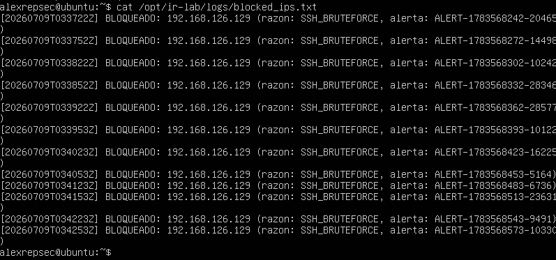
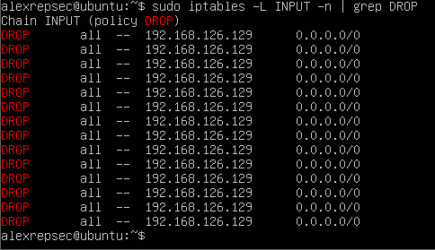
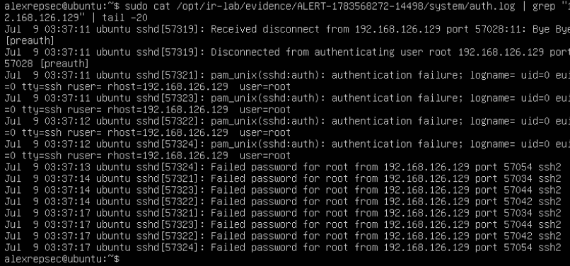
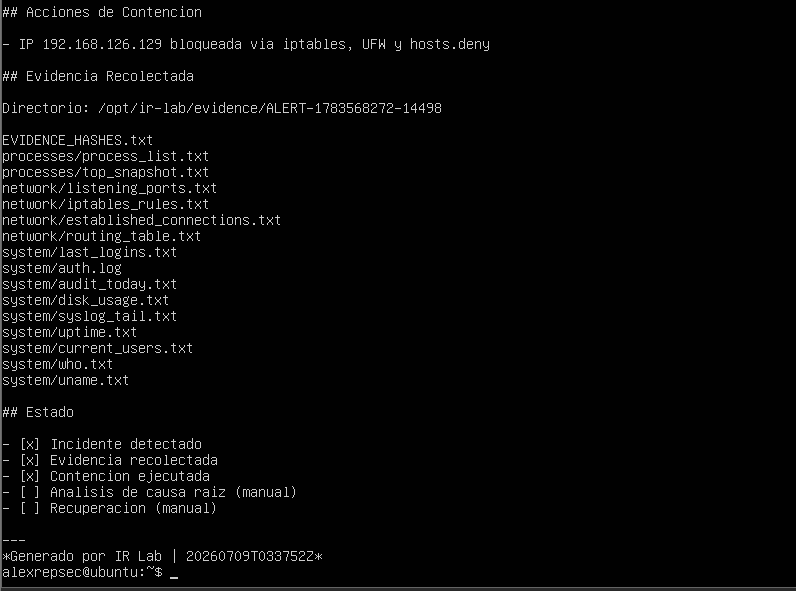

# 🛡️ Incident Response Planning and Execution Lab

[](https://www.gnu.org/software/bash/)
[](https://www.python.org/)
[](https://www.json.org/)
[](https://ubuntu.com/)
[](https://www.kali.org/)
[](https://wazuh.com/)
[](https://www.vmware.com/)
[](https://attack.mitre.org/)

> A fully functional home lab simulating a real-world attacker vs. defender scenario built on VMware with Ubuntu Server and Kali Linux. An automated detection engine monitors the system in real time — when an attack is detected, it triggers a multi-phase response: evidence collection, IP containment, and auto-generated incident reports — all without human intervention.

---

## 📋 Table of Contents

- [Overview](#overview)
- [Lab Architecture](#lab-architecture)
- [How It Works](#how-it-works)
- [Scenarios Covered](#scenarios-covered)
- [Lab Results — Real Attack Captured](#lab-results--real-attack-captured)
- [Alert Format (JSON)](#alert-format-json)
- [Project Structure](#project-structure)
- [Setup](#setup)
- [Evidence Structure](#evidence-structure)
- [Tools & Technologies](#tools--technologies)
- [NIST IR Framework Alignment](#nist-ir-framework-alignment)
- [Playbooks](#playbooks)

---

## Overview

This project demonstrates a complete **Incident Response Planning and Execution** pipeline built with Bash, Python, and JSON. An Ubuntu Server defended by a custom detection engine is attacked by a Kali Linux machine performing SSH brute force and network reconnaissance. The detection engine identifies the attack in real time, automatically contains the threat via iptables and UFW, collects forensic evidence, and generates a structured incident report — all within 30 seconds of the attack threshold being reached.

---

## Lab Architecture

```
┌─────────────────────────────────────┐     ┌──────────────────────────────────┐
│        VM1 — Defender               │     │       VM2 — Attacker             │
│      Ubuntu Server 22.04            │◄────│         Kali Linux               │
│      192.168.126.10                 │     │      192.168.126.129             │
│                                     │     │                                  │
│  ● auditd  (kernel audit logging)   │     │  ● nmap    (reconnaissance)      │
│  ● Fail2ban (adaptive IP banning)   │     │  ● hydra   (SSH brute force)     │
│  ● UFW / iptables (host firewall)   │     │  ● netcat  (reverse shell sim)   │
│  ● detect_incident.sh (engine)      │     │                                  │
│  ● respond.sh (auto-response)       │     │                                  │
│  ● Wazuh Agent (SIEM integration)   │     │                                  │
└─────────────────────────────────────┘     └──────────────────────────────────┘
VMware VMnet1 — Host-Only Network (192.168.126.0/24)
```

---

## How It Works
Attack (Kali)          Detection (Ubuntu)         Response (automated)
──────────────         ──────────────────         ────────────────────
hydra SSH BF    ──►    detect_incident.sh    ──►  Phase 1: Evidence
nmap scan       ──►    polls every 30s            • network state
reverse shell   ──►    threshold reached           • process list
alert written to            • auth.log copy
alerts.json (JSON)          • audit events
──►  Phase 2: Containment
• iptables DROP
• UFW deny
• hosts.deny
──►  Phase 3: Report
• Markdown report
• SHA256 hashes

---

## Scenarios Covered

| # | Scenario | MITRE ATT&CK | Detection Method | Automated Response |
|---|---|---|---|---|
| 1 | SSH Brute Force | T1110.001 | Failed auth threshold ≥5 | Block IP via iptables + UFW + hosts.deny |
| 2 | Port Scan | T1046 | SYN flood detection | Rate-limit + block source IP |
| 3 | Reverse Shell | T1059.004 | Process name pattern match | Kill process + quarantine binary |
| 4 | Privilege Escalation | T1548.001 | New SUID binary detection | Terminate sessions + lock file |
| 5 | File Tampering | T1565.001 | SHA256 hash change | chattr +i + alert |

---

## Lab Results — Real Attack Captured

### Attack Detection
The detection engine identified the SSH brute force from Kali (`192.168.126.129`) and triggered the automated response pipeline within one polling cycle (30 seconds).



---

### IP Containment — iptables DROP Rules
All traffic from the attacker IP was dropped at the kernel level via iptables, with additional blocks applied through UFW and `/etc/hosts.deny`.



---

### Evidence Collected
The response engine captured a full forensic snapshot at the moment of detection — network state, process list, auth logs, audit events — all SHA256-hashed for chain of custody.



---

### Incident Report — Auto-Generated
A structured Markdown incident report was generated automatically, including containment actions taken, evidence paths, and next-step recommendations.



---

## Alert Format (JSON)

Every detection event is written to `/opt/ir-lab/logs/alerts.json` as structured JSON, ready for ingestion into a SIEM or TheHive:

```json
{
  "id": "ALERT-1783568272-14498",
  "timestamp": "2026-07-09T03:37:52Z",
  "severity": "HIGH",
  "type": "SSH_BRUTEFORCE",
  "message": "Brute force: 8 intentos desde 192.168.126.129",
  "src_ip": "192.168.126.129",
  "hostname": "ubuntu"
}
```

---

## Project Structure
incident-response-lab/
├── README.md
├── scripts/
│   ├── setup_environment.sh          # Installs all tools on VM1 (one command)
│   ├── deploy_ir_scripts.sh          # Deploys engine as systemd service
│   ├── ir_dashboard.sh               # Live terminal dashboard
│   ├── detection/
│   │   └── detect_incident.sh        # Detection engine (5 modules, 30s polling)
│   ├── response/
│   │   └── respond.sh                # Evidence + containment + report
│   └── simulation/
│       └── attack_simulation.sh      # 3-phase attack from VM2
├── playbooks/
│   ├── playbook-ssh-bruteforce.md    # Runbook T1110.001
│   └── playbook-port-scan.md         # Runbook T1046
└── configs/
└── wazuh_custom_rules.xml        # 10 custom Wazuh detection rules

---

## Setup

### Prerequisites

| Component | Spec |
|---|---|
| Host OS | Windows 10/11 |
| Hypervisor | VMware Workstation 17+ |
| VM1 | Ubuntu Server 22.04 LTS — 2 vCPU, 2 GB RAM, 20 GB disk |
| VM2 | Kali Linux — 2 vCPU, 2 GB RAM, 20 GB disk |
| Network | VMnet1 Host-Only (192.168.126.0/24) for lab isolation |

### VM1 — Defender Setup

```bash
# Clone the repo
git clone https://github.com/alexrepsec/incident-response-lab.git
cd incident-response-lab

# Install all tools (auditd, fail2ban, ufw, wazuh-agent, net-tools, tcpdump, jq)
sudo bash scripts/setup_environment.sh

# Deploy detection engine as systemd service
sudo bash scripts/deploy_ir_scripts.sh

# Verify service is running
sudo systemctl status ir-detection

# Monitor live
journalctl -u ir-detection -f
```

### VM2 — Attacker Setup

```bash
# Kali has all tools pre-installed
# Verify connectivity to VM1
ping -c 3 192.168.126.10

# Launch SSH brute force attack
hydra -l root -P /usr/share/wordlists/rockyou.txt 192.168.126.10 ssh -t 4 -V
```

---

## Evidence Structure

After an incident is detected, artifacts are organized automatically:

```
/opt/ir-lab/
├── evidence/<ALERT_ID>/
│   ├── network/
│   │   ├── listening_ports.txt         # Open ports at incident time
│   │   ├── established_connections.txt # Active connections
│   │   ├── iptables_rules.txt          # Firewall state
│   │   └── routing_table.txt
│   ├── processes/
│   │   ├── process_list.txt            # Full ps auxef output
│   │   └── top_snapshot.txt
│   ├── system/
│   │   ├── auth.log                    # Authentication log copy
│   │   ├── audit_today.txt             # auditd events
│   │   ├── last_logins.txt
│   │   └── current_users.txt
│   └── EVIDENCE_HASHES.txt            # SHA256 of all artifacts
├── reports/
│   └── incident-report-<ID>.md        # Auto-generated report
├── logs/
│   ├── alerts.json                    # Structured JSON alert feed
│   ├── detection.log                  # Human-readable detection log
│   ├── blocked_ips.txt                # Audit trail of all IP blocks
│   └── response.log                   # Response action log
└── quarantine/                        # Captured malicious binaries
```
---
## Tools & Technologies

| Tool | Purpose |
|---|---|
| `auditd` | Kernel-level syscall monitoring and audit logging |
| `Fail2ban` | Adaptive IP banning based on log pattern matching |
| `UFW / iptables` | Host-based firewall and real-time IP blocking |
| `Wazuh Agent` | SIEM integration with custom detection rules |
| `Bash` | Detection engine, response automation, evidence collection |
| `JSON` | Structured alert format for SIEM ingestion |
| `Python` | Log parsing and audit event processing via auditd |
| `tcpdump` | Packet capture during evidence collection |
| `hydra` | SSH brute force simulation (attacker VM) |
| `nmap` | Network reconnaissance simulation (attacker VM) |
| `tmux` | Multi-terminal session management on Ubuntu Server |
| `sha256sum` | Evidence integrity and chain of custody |

---

## NIST IR Framework Alignment

| Phase | Implementation |
|---|---|
| **Preparation** | auditd rules, Fail2ban config, UFW baseline, detection engine as systemd service |
| **Detection & Analysis** | `detect_incident.sh` — threshold-based detection, JSON alerts, 30s polling cycle |
| **Containment** | `respond.sh` — iptables DROP, UFW deny, hosts.deny, process termination |
| **Eradication** | Playbooks with manual eradication steps and verification commands |
| **Recovery** | Recovery checklists in each playbook |
| **Post-Incident** | Auto-generated Markdown reports with timeline, evidence, and recommendations |

---

## Playbooks

| File | Scenario | MITRE |
|---|---|---|
| `playbooks/playbook-ssh-bruteforce.md` | SSH Brute Force — detection, containment, recovery | T1110.001 |
| `playbooks/playbook-port-scan.md` | Network Reconnaissance — detection, containment | T1046 |

---

> ⚠️ **Disclaimer:** This project was conducted in an isolated VMware lab environment for educational purposes only. All attack simulations were performed on systems owned and controlled by the author. Do not use these scripts or techniques against systems you do not own or have explicit permission to test.

---

## 👤 Author

**alexrepsec**
Cybersecurity enthusiast | Home Lab Builder

*This project was built as part of a cybersecurity portfolio to demonstrate practical incident response, SOC automation, and blue team skills.*
